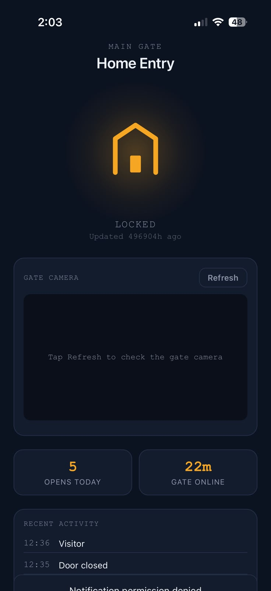
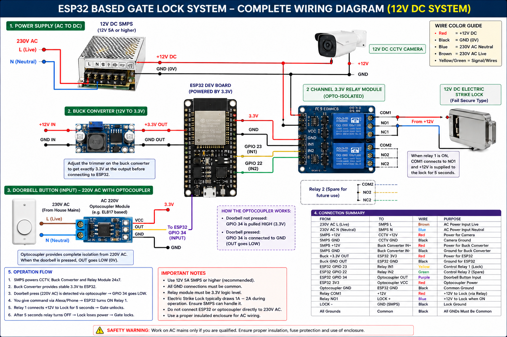
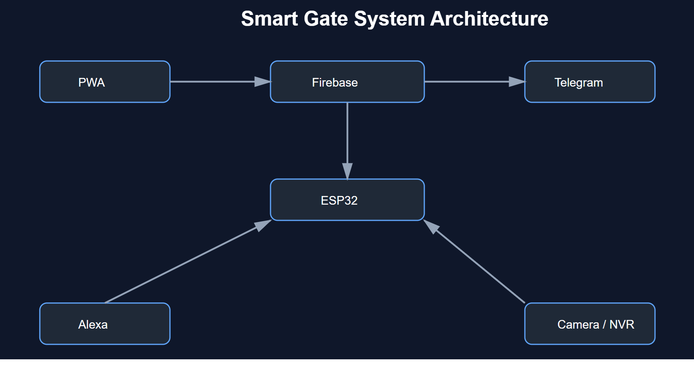

# Smart Gate Automation

[](https://www.espressif.com/en/products/socs/esp32) [](https://firebase.google.com/docs/database) [](LICENSE) [](CONTRIBUTING.md)

An ESP32-based controller for a residential gate: local relay control, a physical doorbell input, Telegram actions, Firebase-backed mobile PWA controls, camera snapshots, event history, daily usage counts, and local Alexa discovery.

> **Safety first:** This project can operate a physical gate. Use an electrically isolated relay/interface, retain the gate controller's safety devices and manual controls, and test with the motor disabled before enabling live operation. This repository intentionally contains no live credentials or private network addresses.

## Highlights

- Timed, active-low relay actuation with automatic re-lock
- Physical doorbell input with debounce and visitor notifications
- Telegram inline actions for open, snapshot, and ignore
- Firebase Realtime Database status, commands, logs, snapshots, and token storage
- Mobile-first installable PWA with push-notification support
- Cached camera snapshots to avoid overwhelming an NVR endpoint
- mDNS local page (`gatecontroller.local`) and local Alexa discovery through Espalexa
- Event log and daily-open counter

## Architecture

```text
Doorbell ──isolated input──> ESP32 ──isolated relay──> Gate controller
                               │  ├── Telegram Bot API
Camera / NVR ──local HTTP──────┤  ├── Firebase Realtime Database
                               │  └── local web page / Alexa
PWA ───────────────────────────┴──── Firebase commands & live status
```

See [Architecture](docs/Architecture.md) for component responsibilities and the database model.

## Visual overview

| Mobile PWA dashboard | Wiring diagram |
| --- | --- |
|  | |  |

### System architecture



Upload the images with these exact names under `docs/images/`. Use redacted demo screenshots only: do not publish faces, number plates, home addresses, device tokens, Wi-Fi names, private IP addresses, or live camera frames.

## Repository layout

```text
firmware/                 ESP32 sketch and private configuration template
web/                      Firebase Hosting PWA
firebase/                 Hosting and security-rule examples
docs/                     Hardware, wiring, Firebase, and architecture guides
.github/                  Issue and pull-request templates
scripts/                  Safe migration helper for the original project files
```

Run `scripts/Prepare-PublicPackage.ps1` from the repository root once to create sanitized copies of the locally mirrored project files in `firmware/` and `web/`. Review the generated files before committing; the script never modifies `sources/`.

## Requirements

### Hardware

- ESP32 development board
- Opto-isolated relay or a properly designed dry-contact interface compatible with the gate controller
- Isolated doorbell sensing interface
- 5 V / 3.3 V power system sized for the hardware
- Optional NVR/IP camera accessible on the local network

### Software and services

- Arduino IDE or PlatformIO with ESP32 support
- Arduino libraries: `UniversalTelegramBot`, `Espalexa`, and their dependencies
- Firebase project with Realtime Database, Hosting, and optionally Cloud Messaging / Cloud Functions
- Node.js and Firebase CLI for the web deployment
- Telegram bot (optional) and an Alexa-capable local network (optional)

## Quick start

1. Copy `.env.example` to a private `.env` file and fill in your values. Never commit it.
2. Run `./scripts/Prepare-PublicPackage.ps1` to generate the sanitized firmware and PWA from the project references.
3. Copy `firmware/include/Config.h.example` to `firmware/include/Config.h`, fill it locally, and keep it untracked.
4. Follow [Wiring](docs/Wiring.md), then [Firebase setup](docs/FirebaseSetup.md).
5. Upload `firmware/SmartGateAutomation.ino` to the ESP32 after verifying the relay logic with the gate motor disconnected.
6. In `web/`, install dependencies and deploy with Firebase CLI after updating its local configuration.

## Configuration and secret handling

Public client Firebase configuration is not by itself a secret, but database rules and API restrictions are essential. **Database auth secrets, bot tokens, Wi-Fi credentials, camera credentials, device tokens, and private URLs are sensitive and must never be committed.**

- Use `.env.example` and `firmware/include/Config.h.example` as schemas only.
- Keep actual values in ignored files (`.env`, `Config.h`, `web/config.local.js`).
- If an exposed credential was ever committed, revoke or rotate it immediately; removing it in a later commit is insufficient.
- Review [SECURITY.md](SECURITY.md) before deployment.

## Setup guides

- [Hardware](docs/Hardware.md)
- [Wiring and safety](docs/Wiring.md)
- [Firebase setup](docs/FirebaseSetup.md)
- [Architecture and database paths](docs/Architecture.md)

## Roadmap

- [ ] Add a tested Firebase Cloud Functions reference implementation
- [ ] Add a printable wiring diagram and enclosure layout
- [ ] Move ESP32 credentials to secure provisioning / NVS
- [ ] Add authentication and granular database rules for every PWA action
- [ ] Add gate position sensors and a fault/obstruction status model
- [ ] Add automated linting and firmware build checks

## Contributing

Contributions are welcome. Please read [CONTRIBUTING.md](CONTRIBUTING.md) and never include real credentials, camera images, access tokens, or identifiable home-network data in an issue or pull request.

## License

Released under the [MIT License](LICENSE).

## Acknowledgements

Built with the ESP32 ecosystem, Firebase, Telegram Bot API, Espalexa, and the broader open-source Arduino community.
